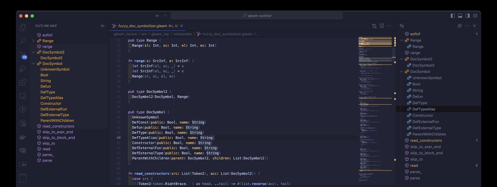

# Gleam Language Outline Extension for VSCode

This is a VSCode extension for the Gleam language that supports code outlining. The extension allows you to view the structure of your Gleam code in an outline view, making it easier to navigate and understand your code.

## release notes
- Added support for @external.
- Improved stability of operation.

## Requirements

This extension requires that Erlang be installed on your system, as the extension relies on Gleam code written in Erlang to function. Please ensure Erlang is installed and properly configured in your system's PATH.

## Tested Environment

- Intel Mac OS Sonoma 14.1.2, Erlang/OTP 26, gleam 0.33.0-rc1
- M1 Mac OS Sonoma 14.1.2, Erlang/OTP 26, gleam 0.33.0-rc1
- Ubuntu 22.04, Erlang/OTP 26, gleam 0.33.0-rc1

## Recommended

In addition to VSCode's standard outline view, we also recommend using Outline Map Extension.

# VSCodeのGleam言語用アウトライン拡張機能

これはGleam言語のVSCode拡張機能で、コードのアウトライン表示をサポートしています。この拡張機能により、Gleamコードの構造をアウトラインビューで確認し、コードの理解やナビゲーションを容易にします。

## release notes
- gleamの@externalに対応しました。
- 動作の安定性を向上させました。

## 必要条件

この拡張機能は、内部でErlangで書かれたGleamコードを動作させるため、Erlangがシステムにインストールされている必要があります。Erlangがインストールされ、システムのPATHに適切に設定されていることを確認してください。

## 動作確認済み環境

- Intel Mac OS Sonoma 14.1.2, Erlang/OTP 26, gleam 0.33.0-rc1
- M1 Mac OS Sonoma 14.1.2, Erlang/OTP 26, gleam 0.33.0-rc1
- Ubuntu 22.04, Erlang/OTP 26, gleam 0.33.0-rc1

## おすすめ

VSCodeの標準のアウトライン表示に加えて、Outline Map Extensionの使用もおすすめします。
